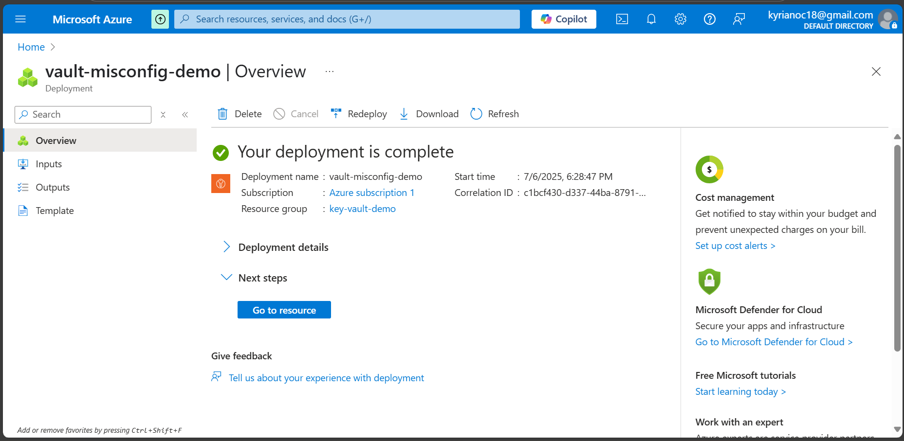
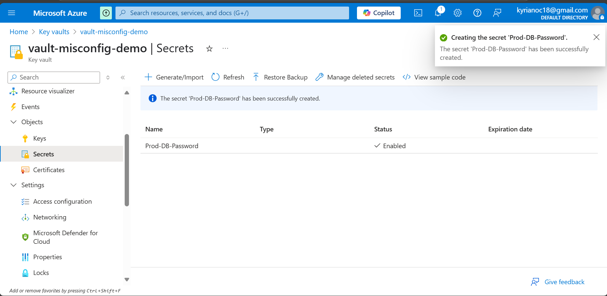
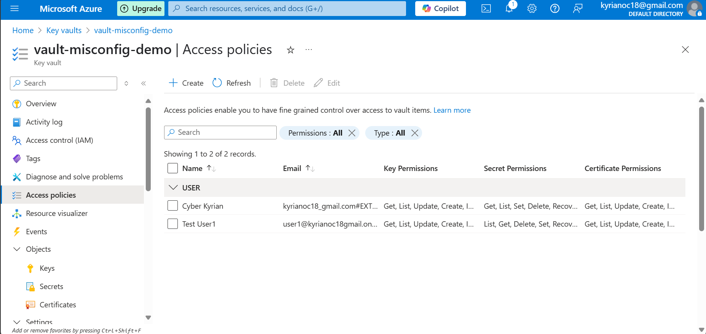
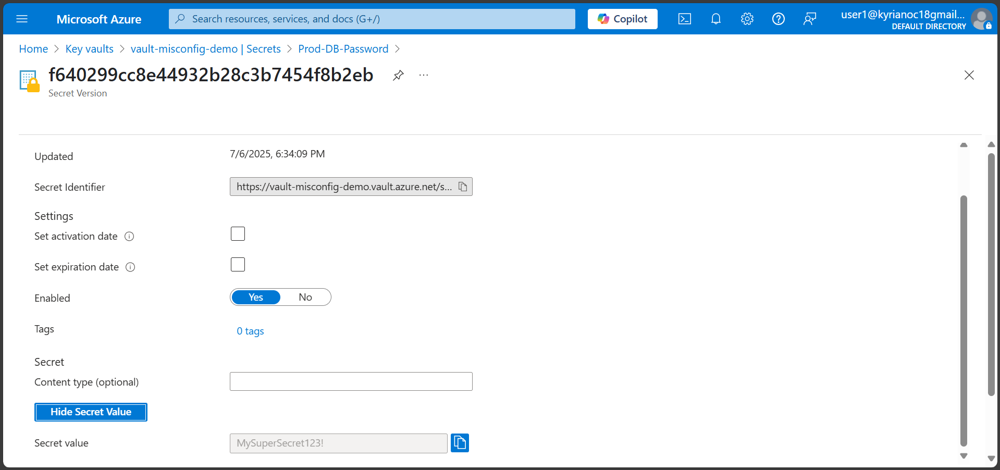
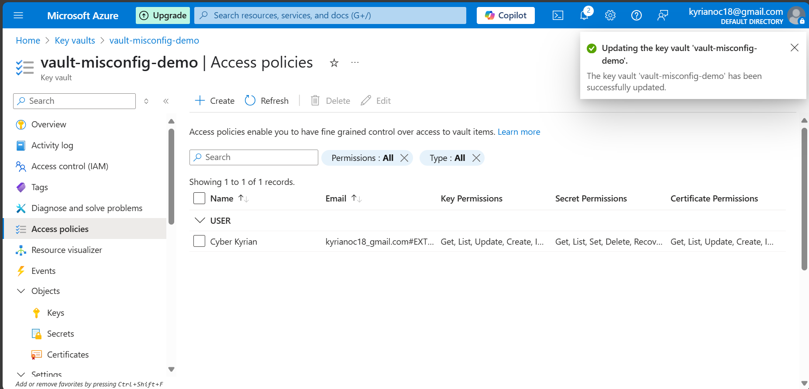
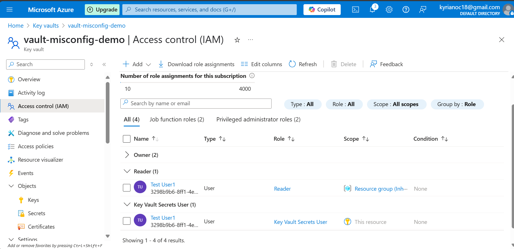
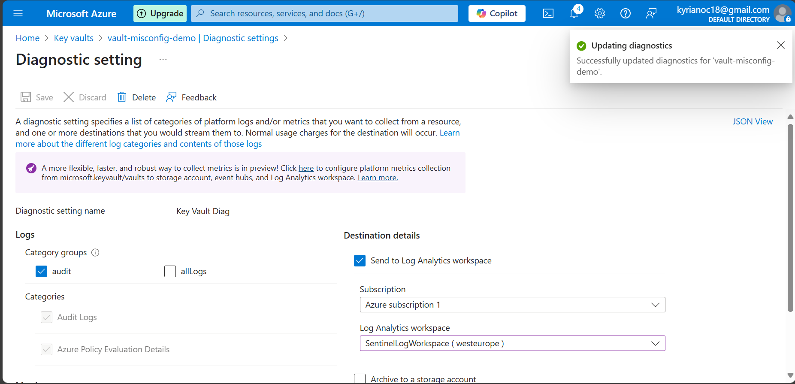

# Azure Key Vault Misconfiguration & Hardening Lab

### Author: Kyrian Onyeagusi

🔗 [LinkedIn](https://www.linkedin.com/in/kyrian-onyeagusi/) | 📧 [Email](mailto:kyrianoc18@gmail.com)

---

## Focus: Simulating and remediating secret access misconfigurations in Azure Key Vault

---

## Overview

In this project, I explored how improper permission configurations in Azure Key Vault can expose sensitive secrets such as database credentials and certificates. The lab simulates real-world misuse by giving a test user overly permissive access to secret management operations and then shows how to correct it by implementing proper RBAC roles and auditing.

This hands-on project mirrors situations where credentials are leaked or altered due to insufficient role scoping.

---

## Tools & Skills Demonstrated

* Azure Key Vault configuration
* Access Policy vs. RBAC model
* Least Privilege implementation (PoLP)
* Secret creation, access, and protection
* Logging with Azure Monitor and Diagnostic Settings

---

## Environment Setup

### Microsoft Azure

* One Azure subscription with access to Key Vault and IAM
* One test user (e.g., `user1@...`)

> ✅ **Screenshot:** Azure portal showing deployed Key Vault
> 

---

## What I Did

I deployed a Key Vault and created a secret labeled `Prod-DB-Password`. I then assigned `user1` broad permissions to the vault using an access policy that allowed Get, List, Set, and Delete on secrets — more access than needed.

> ✅ **Screenshot:** Secret `Prod-DB-Password` created
> 

> ✅ **Screenshot:** `user1` assigned with excessive permissions
> 

Using a private session, I logged in as `user1` and accessed the sensitive secret.

> ✅ **Screenshot:** `user1` viewing secret contents
> 

To fix the issue, I removed the insecure access policy and reassigned `user1` with a more appropriate Reader-level RBAC role (`Key Vault Secrets User`).

> ✅ **Screenshot:** Insecure access policy removed
> 

> ✅ **Screenshot:** Least privilege role applied to `user1`
> 

I then enabled logging to track vault access and ensure audit readiness.

> ✅ **Screenshot:** Diagnostic settings configured to log to Sentinel
> 

---

## Why This Matters

Credential mismanagement is a top cause of cloud security breaches. This project demonstrates my ability to:

* Protect sensitive data in the cloud
* Implement and enforce PoLP using Azure-native tools
* Monitor and log sensitive operations for auditing

---

## Outcome

This project proves I can:

* Identify insecure access policies
* Enforce secure access control with RBAC
* Monitor Key Vault activities for compliance and security

---

## 🔗 Connect

Kyrian Onyeagusi
🔗 [LinkedIn](https://www.linkedin.com/in/kyrian-onyeagusi/) | 📧 [Email](mailto:kyrianoc18@gmail.com)
